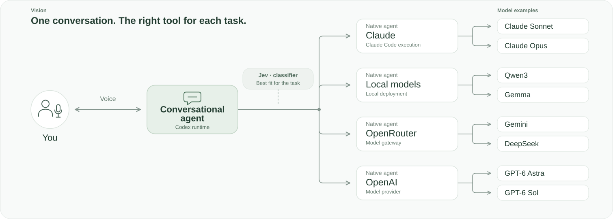

# SushiGPT

A fork of OpenAI Codex built around one capable conversational agent that keeps context and coordinates work across native agents, each using a model suited to its task.

_Vision: These route and model examples illustrate the intended direction, not a list of currently supported integrations. Model families can appear through multiple routes. See [Status](#status) for current capabilities and verification limits._

## Principles

- **One point of contact.** The interface and conversational model should not dictate which models delegated tasks use.
- **Fit comes first.** Required capabilities and quality guide selection, alongside preferences, available resources, and cost.
- **Native agents throughout.** Codex owns agent identity, spawning, communication, status, limits, interruption, and results. Routing extends that lifecycle.
- **Optional selection help.** Jev classifies task metadata against configured criteria and model mappings to help choose a suitable model.

## Status

This checkout includes native routing rules, optional Jev classification, local telemetry, and a local Claude transport that runs delegated tasks through the installed Claude Code CLI. Routing selects models within the active provider, an OpenResponses-compatible provider, or the local Claude provider.

Provider compatibility depends on the configured model, catalog metadata and installed CLI. The OpenResponses adapter and an OpenRouter configuration example are included. A full desktop voice-to-file workflow, cross-platform behavior, multilingual live routing, and end-to-end OpenRouter or local-model inference remain unverified.

## Development and contributions

[Model routing](AGENT_MODEL_ROUTING.md) | [Jev configuration](jev-routing.example.toml) | [Telemetry](SUSHIGPT_TELEMETRY.md)

[Build instructions](docs/install.md) | [Contribution policy](docs/contributing.md)

We welcome contributions only for bug fixes, security and safety issues or fixes, and system stability or reliability. **External feature PRs will not be merged.** See the [contribution policy](docs/contributing.md) for reporting and submission guidance.

---

Built on [OpenAI Codex](https://github.com/openai/codex) | [Apache-2.0 license](LICENSE)
